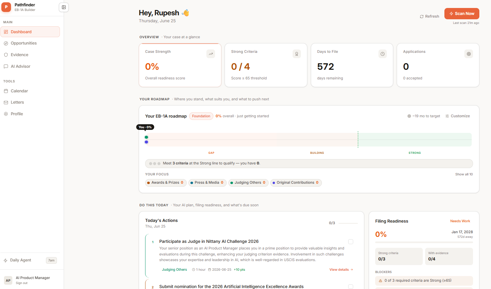
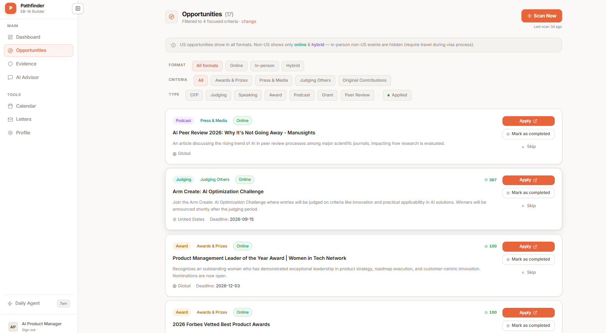

# Pathfinder — EB-1A Case Builder

An open-source multi-agent system that helps you build your EB-1A (extraordinary ability) immigration case. Agents run daily, discover real opportunities worldwide that fill your evidence gaps, score your profile against USCIS standards, and deliver a personalized action plan every morning — without you having to prompt anything.

> Built with Next.js 14, Supabase, Python + Google ADK, and OpenAI/Gemini.
> **Open source under the [MIT License](LICENSE)** — free to use, self-host, fork, and modify. This guide walks you through running the whole stack from scratch; no prior knowledge of the codebase is assumed.

### Dashboard


### Opportunities


---

## What it does

The EB-1A visa requires meeting at least 3 of 10 USCIS criteria (judging, press, awards, publications, salary, etc.). Building a strong case is a months-long process of finding the right opportunities and accumulating evidence.

This system automates the discovery and planning work:

- **Evidence scoring** — scores each of your 10 criteria 0–100 against USCIS rubric, flags critical gaps and RFE risks
- **Worldwide opportunity discovery** — searches for real CFPs, judging seats, speaking slots, awards, and peer review openings that target your weakest criteria
- **Prioritization** — ranks opportunities by gap importance, prestige, acceptance probability, and USCIS precedent approval rates
- **Daily action plans** — delivers 3 concrete, completable actions each morning
- **Weekly reflection** — analyzes your outcomes and completion rate, self-adjusts search strategy for next week
- **USCIS knowledge base** — scrapes AAO decisions, federal court opinions, and the USCIS Policy Manual; extracts patterns by criterion; informs all agent scoring
- **Free EB-1A evaluator** — pre-auth readiness tool at `/evaluate` that scores all 10 criteria and generates a personalized roadmap (no account required)

---

## Stack

| Layer | Technology |
|---|---|
| Frontend | Next.js 14 (App Router, TypeScript, Tailwind CSS — responsive, mobile-ready) |
| Auth + Database | Supabase (Postgres + pgvector + RLS) |
| Agent service | Python 3.11 + FastAPI + Google ADK |
| AI models | OpenAI gpt-4o-mini (primary) or Gemini 2.0 Flash |
| Web search | Tavily API (via direct HTTP) |
| Embeddings | OpenAI text-embedding-3-small |
| Advisor chat | Anthropic Claude → Gemini → OpenAI (first key available, frontend) |
| Hosting | Render (full stack via Blueprint); frontend also deployable to Vercel |

---

## Dependencies

Everything is installed for you by `npm install` (frontend) and `pip install -r requirements.txt` (agents) — you don't install these by hand. They're listed here so you know exactly what the project pulls in and why.

### Frontend — Node / npm (`frontend/package.json`)

| Package | Version | Purpose |
|---|---|---|
| `next` | ^14.2 | React framework — App Router, server actions, API routes |
| `react`, `react-dom` | ^18.3 | UI runtime |
| `@supabase/ssr` | ^0.6 | Cookie-based Supabase auth for the App Router (PKCE) |
| `@supabase/supabase-js` | ^2.69 | Supabase database + auth client |
| `@anthropic-ai/sdk` | ^0.39 | Advisor chat — Anthropic Claude (1st choice) |
| `@google/generative-ai` | ^0.24 | Advisor chat — Gemini (fallback) |
| `openai` | ^6.39 | Advisor chat (fallback) + evaluator scoring |
| `lucide-react` | ^1.17 | Icon set |
| **dev:** `typescript` ^5, `tailwindcss` ^3.4, `postcss` ^8.4, `autoprefixer` ^10.4, `@types/*` | | Build-time tooling and types |

### Agent service — Python / pip (`agents/requirements.txt`)

| Package | Version | Purpose |
|---|---|---|
| `google-adk[extensions]` | >=1.0 | Agent framework (the agent runtime) |
| `google-genai` | >=1.0 | Gemini model SDK |
| `openai` | >=1.30 | OpenAI SDK — agents (gpt-4o-mini) + embeddings |
| `litellm` | >=1.0 | Provider-agnostic LLM routing (OpenAI/Gemini switch) |
| `supabase` | >=2.5 | Supabase client (service-role, server-side) |
| `fastapi` | >=0.111 | HTTP API for the agent endpoints |
| `uvicorn[standard]` | >=0.30 | ASGI server that runs FastAPI |
| `httpx` | >=0.27 | HTTP client (Tavily web search) |
| `pdfplumber` | >=0.10 | Parse USCIS AAO decision PDFs |
| `beautifulsoup4` | >=4.12 | Scrape policy / decision HTML |
| `python-dateutil` | >=2.9 | Robust deadline/date parsing |
| `python-dotenv` | >=1.0 | Load `agents/.env` locally |

### Root — orchestration (`package.json`)

| Package | Purpose |
|---|---|
| `concurrently` | Runs the agent service and frontend together with one `npm run dev` |

### External services (accounts / API keys you provide)

| Service | Required? | Used for |
|---|---|---|
| [Supabase](https://supabase.com) | **Yes** | Auth + Postgres + pgvector (free tier is enough) |
| [OpenAI](https://platform.openai.com) | **Yes** | Agent reasoning + embeddings |
| [Tavily](https://tavily.com) | **Yes** | Worldwide opportunity web search (free tier is enough) |
| [Anthropic](https://console.anthropic.com) **or** [Gemini](https://aistudio.google.com) | **Yes** (one of them) | Dashboard AI advisor chat |
| [Render](https://render.com) | Only to deploy | Hosting + cron jobs (local dev needs none of it) |
| [Resend](https://resend.com) | Optional | Evaluator / password-reset emails |

---

## Repository structure

```
/
├── frontend/                  # Next.js app (Render web service, or Vercel)
│   ├── app/
│   │   ├── (auth)/            # Sign-in, sign-up pages
│   │   ├── onboarding/        # First-time profile + evidence setup
│   │   ├── dashboard/         # Main app (evidence, opportunities, advisor, calendar)
│   │   ├── evaluate/          # Free pre-auth EB-1A evaluator (top-of-funnel)
│   │   ├── actions/           # Server actions (auth, evidence, plans, opportunities, letters)
│   │   └── api/               # Server-side API routes
│   ├── components/            # Shared UI components
│   └── lib/                   # Supabase clients, types, utilities
├── agents/                    # Python agent service (Render)
│   ├── agents/                # 6 ADK agents (evidence, discovery, prioritization, coach, reflection, KB)
│   ├── tools/                 # DB, web search, knowledge base, plan, reflection tools
│   ├── scrapers/              # USCIS AAO, court opinions, policy watcher
│   ├── extractors/            # LLM pattern extractor
│   ├── knowledge/             # EB-1A rubric text
│   ├── tests/                 # Agent unit tests
│   ├── cron_trigger.py        # Cron job entry point
│   ├── model.py               # LLM provider abstraction
│   └── main.py                # FastAPI entry point + all agent orchestration
├── supabase/
│   └── migrations/            # 14 SQL migration files (001–014)
├── docs/                      # Screenshots and assets
├── render.yaml                # Render Blueprint (2 web services + 2 cron jobs)
├── start.ps1                  # Windows convenience script (starts both services)
├── architecture.md            # Full system architecture doc
└── AGENTS.md                  # Agent specs and prompts
```

---

## Agents

The system runs 6 agents in a deterministic daily pipeline. All outputs are written to Supabase before the frontend reads them.

### Daily pipeline (7am UTC, all users)

```
EvidenceAgent → DiscoveryAgent → PrioritizationAgent → CoachAgent
```

| Agent | What it does | Data in | Data out |
|---|---|---|---|
| **EvidenceAgent** | Scores all 10 criteria 0–100, identifies critical gaps | `evidence` table + KB pattern summaries | Gap analysis passed to next agents |
| **DiscoveryAgent** | Web-searches worldwide; scans the user's saved Criteria Focus (or weak criteria if none set) | Tavily API + Supabase dedup | New rows in `opportunities` |
| **PrioritizationAgent** | Scores open opportunities using gap importance + prestige + USCIS approval rates | `opportunities` + `pattern_aggregates` | Updated `priority_score` on each opp |
| **CoachAgent** | Generates top 3 daily actions; carries forward missed deadlines | Top 5 opps + yesterday's plan | Upserts today's `daily_plans` row |

### Weekly pipeline (Sunday midnight UTC)

| Agent | What it does |
|---|---|
| **ReflectionAgent** | Reads outcomes + completion rates; adjusts `strategy_weights` and `actions_per_day` in `profiles`; writes `weekly_reflections` insights |
| **KnowledgeBaseAgent** | Scrapes USCIS AAO decisions, federal court opinions, and Policy Manual; chunks + embeds; extracts criterion-level patterns; refreshes `pattern_aggregates` |

### Prioritization scoring formula

```
score = (prestige × 0.25 + narrative_fit × 0.20 + acceptance_prob × 0.15
       + time_efficiency × 0.10 + gap_weight × 0.20 + profile_fit × 0.10) × 100

each factor rated 1–5 by the agent

gap_weight multiplier:
  criterion score < 40  → 2x   (critical gap)
  criterion score 40–64 → 1.5x (building)
  criterion score ≥ 65  → 1x   (strong)

USCIS precedent boost: ×1.2 if criterion approval_rate > 70%
```

---

## Database schema (Supabase)

All user tables use Row Level Security (`auth.uid() = user_id`). The agent service uses a service-role key server-side; the frontend only holds the anon key.

| Table | Purpose |
|---|---|
| `profiles` | User domain, role, salary band, strategy weights, scan status |
| `evidence` | Evidence per criterion with score 0–100 and strength tier |
| `opportunities` | Agent-discovered opportunities with location, delivery mode, priority score |
| `outcomes` | Application results (pending / accepted / rejected / withdrawn) |
| `daily_plans` | Agent-generated daily actions per user (JSONB array) |
| `weekly_reflections` | Weekly insight arrays + strategy changes |
| `evaluator_assessments` | Free evaluator results (pre-auth, by email) |
| `raw_documents` | Scraped USCIS decisions and policy text |
| `document_chunks` | 1536-dim OpenAI embeddings via pgvector |
| `case_patterns` | LLM-extracted criterion patterns (approved/denied) |
| `pattern_aggregates` | Per-criterion approval rates, top patterns, RFE triggers |
| `scrape_runs` | Scrape job logs |

---

## Setup

Anyone can run the full stack locally — it takes about 10–15 minutes. The flow is: install dependencies → create a free Supabase project and run the migrations → add your API keys to two `.env` files → start both services. Each step below is copy-paste ready.

### Prerequisites

| Requirement | Version / Notes |
|---|---|
| Node.js | 20+ |
| Python | 3.11+ |
| Supabase account | [supabase.com](https://supabase.com) — free tier works |
| OpenAI API key | For agents + embeddings |
| Tavily API key | For web search — [tavily.com](https://tavily.com) |
| Render account | For hosting the agent service + cron jobs |
| Anthropic **or** Gemini API key | For the dashboard AI advisor (frontend only) |

---

### 1. Clone the repository

```bash
git clone https://github.com/Rupesh2026/pathfinder-eb1a.git
cd pathfinder-eb1a
```

---

### 2. Install frontend dependencies

```bash
cd frontend
npm install
```

---

### 3. Install agent dependencies

Create a Python virtual environment first (strongly recommended):

```bash
cd agents

# Create venv
python -m venv venv

# Activate — macOS / Linux
source venv/bin/activate

# Activate — Windows (PowerShell)
.\venv\Scripts\Activate.ps1

# Install packages
pip install -r requirements.txt
```

---

### 4. Set up Supabase

1. Create a new project at [supabase.com](https://supabase.com)
2. Enable the **pgvector** extension: Dashboard → Database → Extensions → search "vector" → enable
3. Run all 14 migrations in order:

**Option A — Supabase CLI (recommended)**

```bash
# Install CLI: https://supabase.com/docs/guides/cli
supabase login
supabase link --project-ref your-project-ref
supabase db push
```

**Option B — SQL Editor (manual)**

Paste and run each file from `supabase/migrations/` in the Supabase SQL editor, in order:

```
001_enums.sql
002_tables.sql
003_indexes.sql
004_rls.sql
005_strategy_weights.sql
006_scan_status.sql
007_daily_plans_update_policy.sql
008_profile_extensions.sql
009_target_filing_date.sql
010_recommendation_letters.sql
011_pgvector.sql
012_knowledge_base.sql
013_opportunity_location.sql
014_evaluator_assessments.sql
```

---

### 5. Configure environment variables

**Frontend** — copy the example and fill in your values:

```bash
cp frontend/.env.local.example frontend/.env.local
```

`frontend/.env.local`:

```env
# Supabase — get from project Settings > API
NEXT_PUBLIC_SUPABASE_URL=https://your-project-ref.supabase.co
NEXT_PUBLIC_SUPABASE_ANON_KEY=your-anon-key

# Agent server — Render URL (or http://localhost:8000 locally)
AGENT_SERVER_URL=https://your-agent-server.onrender.com

# Shared secret — must match CRON_API_KEY in the agent service
CRON_API_KEY=your-cron-api-key

# AI Advisor — add one or both; Anthropic takes priority if both are present
GEMINI_API_KEY=your-gemini-api-key
# ANTHROPIC_API_KEY=sk-ant-your-key
```

**Agent service** — copy the example and fill in your values:

```bash
cp agents/.env.example agents/.env
```

`agents/.env`:

```env
# Supabase — service role key bypasses RLS (never expose to frontend)
SUPABASE_URL=https://your-project-ref.supabase.co
SUPABASE_SERVICE_ROLE_KEY=your-service-role-key

# LLM provider: "openai" or "gemini"
LLM_PROVIDER=openai

# OpenAI (used when LLM_PROVIDER=openai)
OPENAI_API_KEY=sk-your-openai-key

# Gemini — AI Studio (used when LLM_PROVIDER=gemini)
# GEMINI_API_KEY=your-gemini-key

# Gemini — Vertex AI (optional, only if using Vertex instead of AI Studio)
# GOOGLE_APPLICATION_CREDENTIALS=vertex_key.json
# GOOGLE_CLOUD_PROJECT=your-gcp-project-id
# GOOGLE_CLOUD_LOCATION=us-central1
# GOOGLE_GENAI_USE_VERTEXAI=0

# Web search (Tavily)
TAVILY_API_KEY=tvly-your-tavily-key

# Cron security — same value as CRON_API_KEY in frontend/.env.local
CRON_API_KEY=your-cron-api-key
```

---

### 6. Run locally

**macOS / Linux — two terminals:**

```bash
# Terminal 1 — Agent service (http://localhost:8000)
cd agents
source venv/bin/activate
uvicorn main:app --reload --port 8000

# Terminal 2 — Frontend (http://localhost:2028)
cd frontend
npm run dev
```

**Single command (uses `concurrently`):**

After steps 2 and 3 (frontend `npm install` and the agent venv) are done, you can start both services with one command from the repo root:

```bash
# From the repo root — installs only `concurrently`, then runs both services.
# Requires that you already ran `npm install` in frontend/ and set up the agent venv.
npm install
npm run dev
```

**Windows — PowerShell convenience script:**

```powershell
# From the repo root — opens two terminal windows
.\start.ps1
```

Once running:
- Frontend: [http://localhost:2028](http://localhost:2028)
- Agent API docs: [http://localhost:8000/docs](http://localhost:8000/docs)

---

### 7. Seed the knowledge base (optional but recommended)

Run the KB ingestion to populate USCIS AAO patterns used for scoring:

```bash
# Agent service must be running first
curl -X POST http://localhost:8000/run-knowledge-base \
  -H "X-Api-Key: your-cron-api-key"
```

---

### 8. Deploy

**Full stack → Render Blueprint (recommended)**

The `render.yaml` at the repo root deploys everything. See [DEPLOY.md](DEPLOY.md) for the full step-by-step guide and secret checklist.

1. Push the repo to GitHub
2. In Render: **New** → **Blueprint** → connect the repo
3. Render reads `render.yaml` and creates four services:
   - **Web Service** (`eb1a-agent-server`) — FastAPI + Google ADK agent API
   - **Web Service** (`eb1a-frontend`) — Next.js 14 app (dashboard + evaluator)
   - **Cron Job** (`eb1a-daily-trigger`) — runs the daily pipeline at 7am UTC
   - **Cron Job** (`eb1a-weekly-trigger`) — runs weekly reflection at midnight UTC Sunday
4. Fill in the environment variables in each service's **Environment** tab (Render marks them `sync: false`). `CRON_API_KEY` is generated once on the agent server and auto-shared with the crons and frontend via `fromService`.
5. After the agent server is live, set `AGENT_SERVER_URL` / `RENDER_SERVICE_URL` (frontend) and `SERVICE_URL` (both crons) to its URL.

**Frontend → Vercel (alternative)**

Prefer Vercel for the frontend? Delete the `eb1a-frontend` block from `render.yaml`, then:

```bash
npm install -g vercel
vercel deploy
```

Add all `frontend/.env.local` variables in Vercel's project settings under **Environment Variables**.

**Agents only, manual (without Blueprint):**

| Setting | Value |
|---|---|
| Root directory | `agents` |
| Build command | `pip install -r requirements.txt` |
| Start command | `uvicorn main:app --host 0.0.0.0 --port $PORT` |
| Environment | See `agents/.env.example` |

---

## API endpoints

All endpoints require header `X-Api-Key: {CRON_API_KEY}`.

| Endpoint | Trigger | Purpose |
|---|---|---|
| `POST /run-daily-agents` | Render cron 7am UTC | Runs full pipeline for all active users |
| `POST /run-daily-agent` | Dashboard on-demand | Runs pipeline for one user; updates `scan_status` |
| `GET /scan-status/{user_id}` | Dashboard polling | Returns `scan_status`, timestamps |
| `POST /run-weekly-reflection` | Render cron Sunday | Runs ReflectionAgent for all users |
| `POST /run-knowledge-base` | Manual / scheduled | Ingests USCIS decisions into pgvector |

---

## Opportunity visibility rules

The system discovers opportunities worldwide. Non-US in-person events are filtered from the dashboard because they require travel flexibility that users may not have.

| Location | Delivery mode | Shown in dashboard? |
|---|---|---|
| US | Any | Yes |
| Non-US | Online or hybrid | Yes |
| Non-US | In-person only | No (stored in DB, not shown) |

---

## Switching AI models

Set `LLM_PROVIDER` in `agents/.env`:

- `openai` — uses `gpt-4o-mini` (default; its high tokens-per-minute limit absorbs the discovery agent's large web-search contexts, and it's far cheaper)
- `gemini` — uses `gemini-2.0-flash` via AI Studio or Vertex AI

The frontend advisor chat is independent of `LLM_PROVIDER`. It picks the first available key in order **Anthropic (`claude-sonnet-4-6`) → Gemini (`gemini-2.0-flash`) → OpenAI (`gpt-4o`)**, set in `frontend/.env.local`.

---

## Supported EB-1A criteria

1. Awards / prizes (nationally or internationally recognized)
2. Memberships (associations requiring outstanding achievement)
3. Press / media coverage (published material about the person)
4. Judging (of others' work in the field)
5. Original contributions (of major significance)
6. Scholarly articles (in professional journals or major media)
7. Critical role (at distinguished organizations)
8. High salary (relative to peers in the field)
9. Artistic exhibitions *(rarely applicable outside creative fields)*
10. Commercial success *(rarely applicable outside creative fields)*

USCIS minimum: **3 criteria**. A strong petition typically demonstrates 5–6 criteria with substantial, documented evidence.

---

## Running tests

```bash
cd agents
source venv/bin/activate   # or .\venv\Scripts\Activate.ps1 on Windows
python -m pytest tests/ -v
```

---

## Contributing

Pull requests are welcome. Areas that could use help:

- Additional opportunity scrapers (grant databases, conference aggregators)
- More criterion-specific search query templates in `DiscoveryAgent`
- Frontend improvements (evidence upload, letter tracker, calendar view)
- Better PDF parsing for AAO decisions
- Support for additional visa categories (O-1A, NIW)

Please open an issue before starting significant work so we can discuss the approach.

---

## License

This project is **open source** under the **MIT License** — see [LICENSE](LICENSE). You are free to use, copy, modify, self-host, and distribute it, including commercially, provided the copyright notice is retained. No warranty is provided.

---

## Disclaimer

This software is for informational purposes only and does not constitute legal advice. Immigration decisions are complex and fact-specific. Always consult a qualified immigration attorney before filing any petition.
